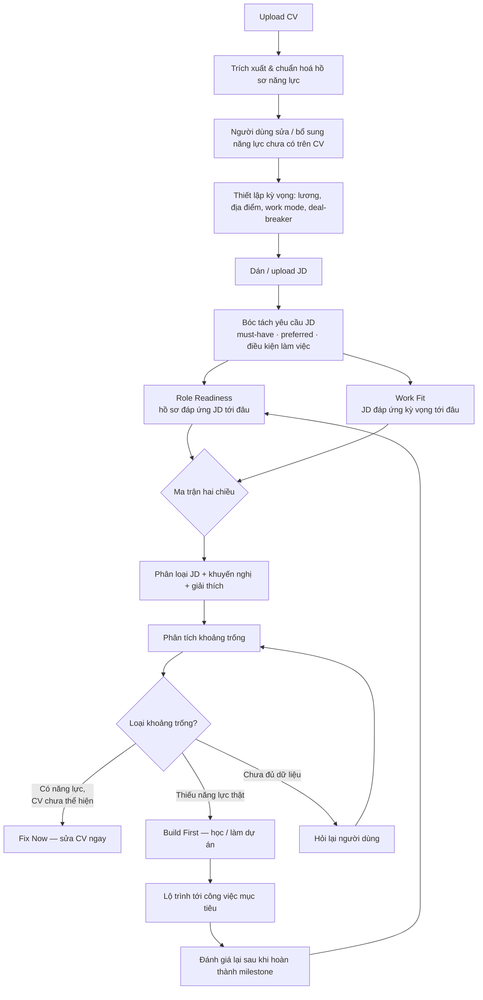
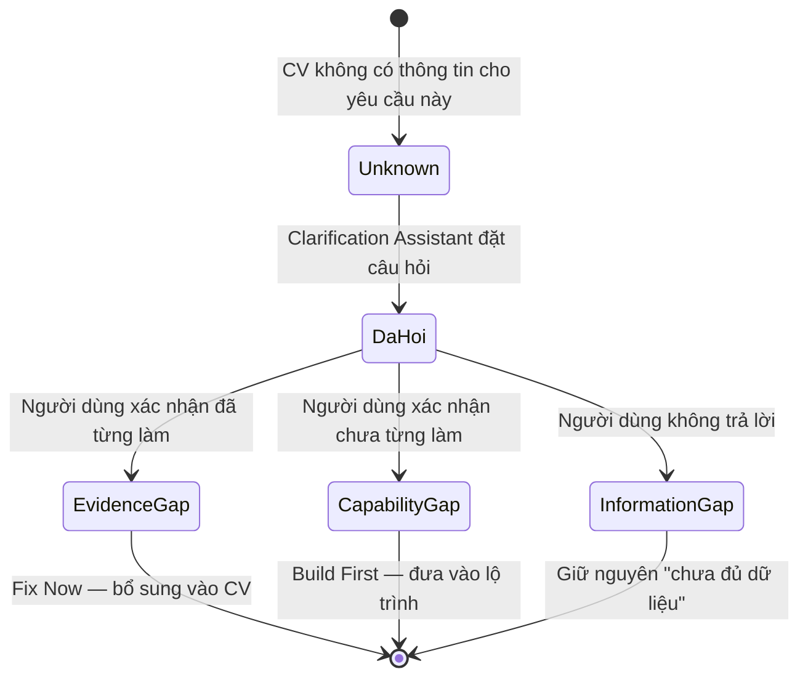

# JobAlign — Tài liệu Mô tả Yêu cầu Người dùng (URD)

> **Đầu việc:** `MASTERPLAN` — STT 4 "Mô tả tính năng (URD)"
> **PIC:** Trâm Anh, Tuyết Nhung · **Thời hạn:** 08/09 → 11/09 · **Phiên bản:** v1.0 (08/09)
> **Nguồn:** [02-brief.md](02-brief.md), [03-mo-ta-tinh-nang.md](03-mo-ta-tinh-nang.md), [04-chon-de-tai.md](04-chon-de-tai.md)

---

## 1. Mục đích và phạm vi tài liệu

Tài liệu này mô tả **người dùng cần gì ở JobAlign và vì sao**, không mô tả thiết kế kỹ
thuật hay cách cài đặt. Mỗi yêu cầu được viết ở góc nhìn người dùng, kèm tiêu chí chấp
nhận để nhóm biết khi nào coi là "làm xong".

- **Đối tượng đọc:** nhóm phát triển, checker, giảng viên hướng dẫn.
- **Phạm vi:** toàn bộ 3 nhóm tính năng / 20 module / 95 yêu cầu đã thống nhất trong
  sheet `DESCRIPTION`.
- **Không thuộc phạm vi tài liệu:** kiến trúc hệ thống, thiết kế database, thiết kế
  giao diện chi tiết (thuộc đầu việc STT 5–7 trong masterplan).
- **Đề xuất phạm vi triển khai** (cái gì làm trước, cái gì để sau) nằm ở [mục 8](#8-phạm-vi-triển-khai-đề-xuất).

## 2. Thuật ngữ

| Thuật ngữ | Nghĩa dùng trong tài liệu |
| --- | --- |
| **JD** | Job Description — bản mô tả công việc do nhà tuyển dụng đăng |
| **Evidence** | Bằng chứng trong CV (hoặc do người dùng bổ sung) chứng minh một năng lực |
| **Evidence Gap** | Người dùng **có** năng lực nhưng CV chưa thể hiện được → sửa CV là đủ |
| **Capability Gap** | Người dùng **thực sự chưa có** năng lực → phải học/làm mới có |
| **Role Readiness** | Mức sẵn sàng ứng tuyển: hồ sơ đáp ứng yêu cầu JD tới đâu |
| **Work Fit** | Mức công việc đáp ứng kỳ vọng cá nhân (lương, địa điểm, chế độ…) |
| **Must-have** | Yêu cầu bắt buộc của JD, không đạt thì gần như bị loại |
| **Deal-breaker** | Điều kiện của **người dùng**, vi phạm thì họ không muốn ứng tuyển |
| **Unknown** | JD không nêu thông tin → hệ thống đánh dấu thiếu, **không** tự suy đoán |
| **Taxonomy** | Từ điển kỹ năng chuẩn hoá (kèm alias) dùng để đối chiếu CV ↔ JD |
| **Skill ROI** | Độ ưu tiên học một kỹ năng = tác động lên nhiều JD mục tiêu / công sức bỏ ra |

## 3. Bối cảnh và vấn đề người dùng

Sinh viên và người mới đi làm phải chọn giữa nhiều JD có yêu cầu rất khác nhau. JD liệt
kê nhiều tiêu chí nhưng không nói rõ đâu là bắt buộc, đâu là ưu tiên; người ứng tuyển
cũng không biết hồ sơ của mình đang ở đâu so với các tiêu chí đó.

Năm câu hỏi người dùng không tự trả lời được:

1. Mình đã đáp ứng những yêu cầu nào?
2. Năng lực nào **đã có** nhưng CV chưa thể hiện tốt?
3. Năng lực nào **thực sự còn thiếu**?
4. Khoảng trống nào quan trọng nhất, cần ưu tiên xử lý trước?
5. Công việc này có phù hợp với kỳ vọng nghề nghiệp của mình không?

→ Quyết định ứng tuyển thường dựa vào cảm tính hoặc một vài yếu tố rời rạc.

**Các phương án hiện có đều hụt một mảng:** tự đánh giá thì thiên lệch; mentor/HR thì
khó tiếp cận thường xuyên; AI chatbot cho kết quả rời rạc giữa các lần dùng, không giữ
được hồ sơ năng lực xuyên suốt; CV scanner tối ưu keyword/ATS chứ không phân biệt được
"thiếu năng lực" với "thiếu cách trình bày"; nền tảng khoá học đề xuất nội dung nhưng
không nói kỹ năng nào đáng học trước; apply hàng loạt thì tốn thời gian và lặp lại đúng
lỗi cũ trên CV.

## 4. Đối tượng người dùng

| Persona | Mô tả | Mục tiêu chính | Khó khăn đặc thù |
| --- | --- | --- | --- |
| **P1 — Sinh viên năm cuối / mới tốt nghiệp** *(nhóm chính)* | Ít hoặc chưa có kinh nghiệm tuyển dụng, đang tìm intern/fresher white-collar | Biết nên nộp JD nào, CV cần sửa gì | Chưa biết đọc JD; CV mỏng evidence; dễ tự đánh giá sai |
| **P2 — Người đi làm 0–3 năm** *(nhóm chính)* | Đã có việc, muốn đổi chỗ tốt hơn | So sánh offer/JD theo cả năng lực lẫn đãi ngộ | Ít thời gian; quan tâm mạnh tới lương, khoảng cách, work mode |
| **P3 — Người chuyển ngành** *(nhóm thứ cấp)* | Có kinh nghiệm nhưng khác lĩnh vực | Biết kỹ năng nào chuyển đổi được, thiếu gì trước khi apply | Khó tự nhận ra transferable skills; lộ trình bù đắp dài |

**Trạng thái cảm xúc cần được thiết kế cho:** không chắc mình có đủ khả năng ứng tuyển;
lo lắng khi JD có quá nhiều yêu cầu; mất tự tin sau nhiều lần apply không phản hồi; FOMO
trước một JD hấp dẫn; quá tải trước quá nhiều lời khuyên; hoặc ngược lại — ảo tưởng về
mức độ phù hợp và tiếp tục nộp vào những vị trí chưa vừa sức.

→ Hệ quả thiết kế: kết quả phải **giải thích được**, dùng ngôn ngữ "mức sẵn sàng" thay
vì phán xét, và luôn kèm bước hành động tiếp theo.

## 5. Mục tiêu sản phẩm và USP

JobAlign không chỉ chấm mức độ khớp giữa CV và JD mà **đánh giá hai chiều**: ứng viên có
phù hợp với công việc, và công việc có phù hợp với kỳ vọng của ứng viên. Hệ thống phân
biệt rõ "năng lực đã có nhưng chưa thể hiện tốt trên CV" với "năng lực thực sự còn
thiếu", rồi chuyển kết quả phân tích thành **lộ trình hành động cụ thể**.

### 5 nguyên tắc sản phẩm

| # | Nguyên tắc | Ràng buộc nó đặt ra |
| --- | --- | --- |
| NT-1 | **Hai chiều** | Mọi kết luận về một JD phải có cả Role Readiness lẫn Work Fit |
| NT-2 | **Phân biệt hai loại khoảng trống** | Không được gộp Evidence Gap và Capability Gap vào một con số |
| NT-3 | **Không suy đoán** | Thông tin JD không nêu → `Unknown`, tuyệt đối không tự điền |
| NT-4 | **Không hứa xác suất trúng tuyển** | Chỉ nói "mức sẵn sàng", vì không có dữ liệu tuyển dụng thật |
| NT-5 | **Kết quả phải ra hành động** | Mỗi điểm số đi kèm lý do và việc cần làm tiếp theo |

## 6. Luồng người dùng chính

### Vòng xử lý trạng thái `Unknown`

Đây là cơ chế bảo vệ NT-2 và NT-3 — không được kết luận người dùng thiếu năng lực chỉ vì
CV không nhắc tới nó.

---

## 7. Yêu cầu người dùng

Mã yêu cầu `UR-x.y.z` bám đúng cấu trúc tầng 1 / tầng 2 / tầng 3 của sheet `DESCRIPTION`
để dễ đối chiếu ngược. Cột **Ưu tiên** dùng MoSCoW: **M** = Must, **S** = Should,
**C** = Could.

## 7.1. Nhóm 1 — Job Fit Analysis (Phân tích độ phù hợp hai chiều)

Trả lời hai câu hỏi độc lập nhau về cùng một JD, rồi hợp lại thành một khuyến nghị.

### UR-1.1 · Candidate Profile Builder

> **User story:** Là một ứng viên, tôi muốn hệ thống đọc CV của tôi một lần rồi giữ lại
> hồ sơ năng lực có cấu trúc, để tôi không phải nhập lại thông tin cho từng JD.

**Tiêu chí chấp nhận**

- Upload CV (PDF/DOCX) → hệ thống trả về hồ sơ có cấu trúc trong ≤ 30 giây.
- Người dùng xem và **sửa được** mọi trường đã trích xuất trước khi lưu.
- Hồ sơ đã lưu được tái sử dụng cho mọi JD sau đó, không cần parse lại.
- Mỗi thông tin hiển thị rõ nguồn: lấy từ CV / do người dùng bổ sung / chưa đủ dữ liệu.

| Mã | Yêu cầu | Người dùng nhận được gì | Ưu tiên |
| --- | --- | --- | --- |
| UR-1.1.1 | CV Parsing | Đọc CV và trích xuất học vấn, kinh nghiệm, kỹ năng, dự án, chứng chỉ, thành tích | M |
| UR-1.1.2 | Profile Structuring | Hồ sơ năng lực chuẩn hoá, dùng lại cho tất cả JD về sau | M |
| UR-1.1.3 | Profile Enrichment | Bổ sung năng lực/kinh nghiệm thực tế mà CV chưa thể hiện | M |
| UR-1.1.4 | Data Verification | Phân biệt thông tin đã xác nhận, thông tin từ CV, và thông tin chưa đủ dữ liệu | M |

### UR-1.2 · Career Preference Setup

> **User story:** Là một ứng viên, tôi muốn khai báo kỳ vọng của mình về lương, địa điểm
> và chế độ làm việc, để hệ thống đánh giá công việc theo tiêu chuẩn của tôi chứ không
> chỉ theo yêu cầu của nhà tuyển dụng.

> **Ghi chú từ sheet:** toàn bộ module này là form thu thập thông tin từ người dùng —
> không cần AI.

**Tiêu chí chấp nhận**

- Người dùng đặt được kỳ vọng cho từng tiêu chí và gắn nhãn Must-have / Important /
  Nice-to-have.
- Người dùng khai báo được ít nhất một deal-breaker; JD vi phạm bị đánh dấu trước khi
  chấm điểm.
- Kỳ vọng được lưu ở cấp tài khoản, áp dụng cho mọi JD, sửa lại lúc nào cũng được.

| Mã | Yêu cầu | Người dùng nhận được gì | Ưu tiên |
| --- | --- | --- | --- |
| UR-1.2.1 | Salary Preference | Đặt mức thu nhập mong muốn hoặc mức tối thiểu chấp nhận được | M |
| UR-1.2.2 | Location & Commute | Đặt khu vực làm việc và thời gian/khoảng cách di chuyển chấp nhận được | M |
| UR-1.2.3 | Work Mode | Đặt preference onsite / hybrid / remote | M |
| UR-1.2.4 | Career Growth Preference | Đặt mức ưu tiên với đào tạo, thăng tiến, phát triển nghề nghiệp | S |
| UR-1.2.5 | Preference Weighting | Gắn nhãn Must-have / Important / Nice-to-have thay vì cào bằng trọng số | S |
| UR-1.2.6 | Deal-breaker Setting | Khai báo điều kiện mà nếu không đáp ứng thì không muốn ứng tuyển | M |

### UR-1.3 · JD Analyzer

> **User story:** Là một ứng viên, tôi muốn hệ thống bóc tách JD thành các tiêu chí rõ
> ràng, để tôi biết đâu là yêu cầu bắt buộc và đâu chỉ là ưu tiên.

> **Ghi chú từ sheet:** module này tốn token → mỗi JD chỉ trích xuất **một lần** rồi lưu
> lại kết quả.

**Tiêu chí chấp nhận**

- JD được chuyển thành danh sách tiêu chí có cấu trúc, mỗi tiêu chí gắn nhãn must-have
  hoặc preferred.
- Người dùng sửa được kết quả bóc tách sai.
- Trường JD không nêu được đánh dấu `Unknown`; hệ thống **không** tự điền giá trị suy đoán.
- Một JD đã phân tích không bị gọi lại LLM khi mở lại.

| Mã | Yêu cầu | Người dùng nhận được gì | Ưu tiên |
| --- | --- | --- | --- |
| UR-1.3.1 | Requirement Extraction | Bóc tách yêu cầu kỹ năng, kinh nghiệm, trình độ, chứng chỉ, ngoại ngữ | M |
| UR-1.3.2 | Must-have Detection | Chỉ ra yêu cầu bắt buộc / có thể là tiêu chí loại | M |
| UR-1.3.3 | Preferred Requirement Detection | Tách riêng tiêu chí mang tính ưu tiên, lợi thế | S |
| UR-1.3.4 | Responsibility Extraction | Danh sách nhiệm vụ thực tế sẽ phải làm ở vị trí đó | S |
| UR-1.3.5 | Seniority Detection | Mức seniority JD kỳ vọng (qua scope, số năm KN, trách nhiệm) | S |
| UR-1.3.6 | Work Condition Extraction | Lương, phúc lợi, địa điểm, work mode, thời gian làm việc (nếu JD có nêu) | M |
| UR-1.3.7 | Unknown Information Detection | Thông tin JD không đề cập được đánh dấu `Unknown`, không suy đoán | M |

### UR-1.4 · Role Readiness — *chiều 1: tôi có phù hợp với công việc không?*

> **User story:** Là một ứng viên, tôi muốn biết hồ sơ của mình đáp ứng JD tới đâu và
> vướng ở tiêu chí nào, để quyết định có nên đầu tư thời gian ứng tuyển hay không.

> **Ghi chú từ sheet:** đối chiếu bằng từ điển kỹ năng + code thường, **không** dùng LLM
> để chấm điểm — điểm số phải tái lập được và giải thích được.

**Tiêu chí chấp nhận**

- Mỗi yêu cầu của JD được đối chiếu với hồ sơ và hiển thị trạng thái đạt / một phần / chưa đạt.
- Must-have chưa đạt được nêu riêng thành blocker kèm lý do.
- Điểm Readiness kèm mức độ tin cậy dựa trên lượng thông tin hiện có.
- Kết quả gọi là "mức sẵn sàng ứng tuyển", **không** gọi là xác suất trúng tuyển (NT-4).
- Chạy lại cùng CV + cùng JD phải ra cùng kết quả.

| Mã | Yêu cầu | Người dùng nhận được gì | Ưu tiên |
| --- | --- | --- | --- |
| UR-1.4.1 | Requirement Matching | Đối chiếu từng requirement của JD với hồ sơ năng lực | M |
| UR-1.4.2 | Skill Fit | Mức độ phù hợp về kỹ năng | M |
| UR-1.4.3 | Experience Fit | Mức độ liên quan và chiều sâu của kinh nghiệm | M |
| UR-1.4.4 | Responsibility Fit | Mức tương đồng giữa việc đã làm và trách nhiệm vị trí mới | C |
| UR-1.4.5 | Qualification Fit | Đối chiếu bằng cấp, chứng chỉ, ngoại ngữ | S |
| UR-1.4.6 | Blocker Detection | Chỉ ra tiêu chí bắt buộc chưa đáp ứng, có thể thành rào cản | M |
| UR-1.4.7 | Readiness Score | Một mức sẵn sàng ứng tuyển tổng hợp | M |
| UR-1.4.8 | Confidence Level | Mức độ chắc chắn của kết quả theo lượng thông tin có được | S |

### UR-1.5 · Work Fit — *chiều 2: công việc có phù hợp với tôi không?*

> **User story:** Là một ứng viên, tôi muốn biết công việc này đáp ứng kỳ vọng của tôi
> tới đâu, để không nhận một offer rồi bỏ vì lương thấp hoặc đi làm quá xa.

**Tiêu chí chấp nhận**

- Từng tiêu chí kỳ vọng được so với điều kiện JD và trả về đạt / không đạt / `Unknown`.
- Vi phạm deal-breaker được cảnh báo nổi bật, không bị chìm trong điểm tổng.
- Tiêu chí JD không công bố được liệt kê riêng là "chưa đánh giá được", không tính là đạt.

| Mã | Yêu cầu | Người dùng nhận được gì | Ưu tiên |
| --- | --- | --- | --- |
| UR-1.5.1 | Preference Matching | So sánh điều kiện công việc với kỳ vọng cá nhân đã thiết lập | M |
| UR-1.5.2 | Deal-breaker Check | Cảnh báo công việc vi phạm điều kiện bắt buộc của người dùng | M |
| UR-1.5.3 | Work Fit Score | Mức đáp ứng kỳ vọng nghề nghiệp tổng hợp | M |
| UR-1.5.4 | Missing Information Warning | Danh sách tiêu chí chưa đánh giá được vì JD không công bố | S |

### UR-1.6 · Two-way Fit Decision

> **User story:** Là một ứng viên đang phân vân giữa nhiều JD, tôi muốn một khuyến nghị
> rõ ràng kèm lý do, để biết nên ưu tiên nộp cái nào trước.

**Tiêu chí chấp nhận**

- Mỗi JD được đặt lên ma trận hai chiều và rơi vào đúng một ô.
- Mỗi khuyến nghị đi kèm giải thích cụ thể (kỹ năng thiếu, deal-breaker vi phạm…), không
  chỉ đưa một con số.
- Ngưỡng phân loại cấu hình được, không hard-code rải rác.

| Mã | Yêu cầu | Người dùng nhận được gì | Ưu tiên |
| --- | --- | --- | --- |
| UR-1.6.1 | Fit Matrix | Role Readiness và Work Fit đặt trên cùng một ma trận hai chiều | M |
| UR-1.6.2 | Job Classification | JD được phân loại thành 1 trong 4 nhóm ưu tiên | M |
| UR-1.6.3 | Apply Recommendation | Khuyến nghị hành động: ưu tiên nộp / thử sức / cân nhắc / chưa nên | M |
| UR-1.6.4 | Decision Explanation | Giải thích vì sao hệ thống khuyến nghị như vậy | M |

#### Ma trận quyết định hai chiều

Đây là màn hình lõi của sản phẩm — hợp nhất cách gọi trong `[DONE] CHỌN ĐỀ TÀI` với cách
phân loại trong `DESCRIPTION`:

| | **Work Fit thấp** | **Work Fit cao** (đãi ngộ/kỳ vọng đạt) |
| --- | --- | --- |
| **Readiness cao** | 🛡️ **Ô An toàn** → `Backup/Consider` Dễ pass nhưng chưa đạt kỳ vọng — để dự phòng | 💎 **Ô Kim Cương** → `Priority Apply` Phù hợp cả hai chiều — nộp ngay |
| **Readiness thấp** | ⏸️ **Ô Chưa ưu tiên** → `Low Priority` Chưa nên dành nhiều thời gian | 🔥 **Ô Thách Thức** → `Stretch Opportunity` Đãi ngộ tốt nhưng còn thiếu năng lực — đáng đầu tư lộ trình |

Ô Thách Thức chính là cầu nối sang nhóm 3: đây là những JD đáng để lập lộ trình bù đắp
năng lực, thay vì bỏ qua.

## 7.2. Nhóm 2 — Gap & CV Improvement

Trả lời câu hỏi *"tôi thiếu gì, và trong đó cái nào chỉ là chưa biết cách viết ra?"*

### UR-2.1 · Requirement–Evidence Mapping

> **User story:** Là một ứng viên, tôi muốn thấy từng yêu cầu của JD được đối chiếu với
> đúng dòng nào trong CV của mình, để hiểu vì sao hệ thống kết luận như vậy.

**Tiêu chí chấp nhận**

- Mỗi yêu cầu JD hiển thị kèm evidence tương ứng trong CV (nếu có).
- Mức độ phủ của mỗi yêu cầu hiển thị rõ: đầy đủ / một phần / chưa có bằng chứng.
- Evidence được đánh giá mạnh/yếu theo tiêu chí công khai (có số liệu, độ liên quan, độ cụ thể).

| Mã | Yêu cầu | Người dùng nhận được gì | Ưu tiên |
| --- | --- | --- | --- |
| UR-2.1.1 | Requirement Breakdown | Mỗi yêu cầu JD thành một tiêu chí đánh giá được | M |
| UR-2.1.2 | CV Evidence Retrieval | Tìm nội dung trong CV chứng minh cho từng yêu cầu | M |
| UR-2.1.3 | Evidence Strength | Đánh giá bằng chứng mạnh/yếu theo độ cụ thể, liên quan, kết quả | S |
| UR-2.1.4 | Requirement Coverage | Trạng thái phủ: đầy đủ / một phần / chưa có bằng chứng | M |

### UR-2.2 · Clarification Assistant

> **User story:** Là một ứng viên, tôi muốn được hỏi lại khi CV thiếu thông tin, để hệ
> thống không kết luận nhầm rằng tôi không có năng lực đó.

**Tiêu chí chấp nhận**

- Hệ thống chỉ hỏi với những yêu cầu đang ở trạng thái `Unknown`, không hỏi tràn lan.
- Sau khi trả lời, trạng thái chuyển thành Evidence Gap hoặc Capability Gap (xem sơ đồ
  trạng thái ở mục 6).
- Người dùng bỏ qua được câu hỏi; khi đó tiêu chí giữ nguyên "chưa đủ dữ liệu".
- Thông tin bổ sung được lưu vào hồ sơ, không hỏi lại ở JD sau.

| Mã | Yêu cầu | Người dùng nhận được gì | Ưu tiên |
| --- | --- | --- | --- |
| UR-2.2.1 | Missing Evidence Question | Được hỏi lại khi CV thiếu thông tin, thay vì bị kết luận là thiếu năng lực | M |
| UR-2.2.2 | Experience Confirmation | Xác nhận đã từng dùng kỹ năng / làm công việc đó chưa | M |
| UR-2.2.3 | Evidence Collection | Bổ sung bối cảnh, kết quả, thời gian cho trải nghiệm chưa ghi vào CV | S |
| UR-2.2.4 | Unknown Resolution | `Unknown` chuyển thành Evidence Gap hoặc Capability Gap sau khi có thông tin | M |

### UR-2.3 · Gap Classification

> **User story:** Là một ứng viên, tôi muốn biết khoảng trống của mình thuộc loại nào,
> để biết nên sửa CV hay phải đi học thật.

**Tiêu chí chấp nhận**

- Mỗi khoảng trống được gán đúng một loại trong 6 loại dưới đây.
- Evidence Gap và Capability Gap **không** bị gộp chung khi hiển thị (NT-2).
- Khi không đủ dữ liệu, hệ thống giữ trạng thái Information Gap thay vì tự kết luận.

| Mã | Yêu cầu | Người dùng nhận được gì | Ưu tiên |
| --- | --- | --- | --- |
| UR-2.3.1 | Evidence Gap | Có năng lực nhưng CV chưa thể hiện hoặc thể hiện quá yếu | M |
| UR-2.3.2 | Skill Gap | Thực sự chưa có kỹ năng JD yêu cầu | M |
| UR-2.3.3 | Experience Gap | Có kỹ năng nhưng thiếu chiều sâu hoặc thời lượng kinh nghiệm | S |
| UR-2.3.4 | Responsibility Gap | Chưa từng đảm nhiệm scope/trách nhiệm tương đương | C |
| UR-2.3.5 | Qualification Gap | Thiếu chứng chỉ, bằng cấp, ngoại ngữ bắt buộc | S |
| UR-2.3.6 | Information Gap | Không đủ dữ liệu để kết luận | M |

### UR-2.4 · Gap Prioritization

> **User story:** Là một ứng viên đang thấy quá nhiều thứ phải cải thiện, tôi muốn biết
> nên xử lý cái nào trước, để không bị quá tải.

**Tiêu chí chấp nhận**

- Khoảng trống gắn với must-have luôn đứng đầu danh sách ưu tiên.
- Mỗi khoảng trống hiển thị mức Critical / High / Medium / Low.
- Tiêu chí nice-to-have bị hạ ưu tiên, không gây nhiễu danh sách việc cần làm.

| Mã | Yêu cầu | Người dùng nhận được gì | Ưu tiên |
| --- | --- | --- | --- |
| UR-2.4.1 | Must-have Gap | Khoảng trống ảnh hưởng trực tiếp tới eligibility được xếp cao nhất | M |
| UR-2.4.2 | High-impact Gap | Khoảng trống ở requirement quan trọng được ưu tiên xử lý | S |
| UR-2.4.3 | Low-impact Gap | Tiêu chí nice-to-have được hạ mức ưu tiên | S |
| UR-2.4.4 | Gap Severity | Mức Critical / High / Medium / Low cho từng khoảng trống | S |

### UR-2.5 · CV Improvement

> **User story:** Là một ứng viên, tôi muốn được gợi ý sửa CV dựa trên những gì tôi thật
> sự đã làm, để CV thể hiện đúng năng lực mà không phải nói quá.

**Tiêu chí chấp nhận**

- Mọi gợi ý chỉ dựa trên evidence người dùng đã cung cấp hoặc xác nhận.
- Hệ thống **chặn** mọi đề xuất thêm kỹ năng/kinh nghiệm/thành tích chưa có evidence (NT-5).
- Nội dung do AI viết lại phải được người dùng duyệt trước khi đưa vào CV.
- Gợi ý keyword chỉ áp dụng khi hồ sơ đã xác nhận có kỹ năng đó.

| Mã | Yêu cầu | Người dùng nhận được gì | Ưu tiên |
| --- | --- | --- | --- |
| UR-2.5.1 | Content Prioritization | Biết nội dung nào nên đưa lên trước hoặc nhấn mạnh hơn | S |
| UR-2.5.2 | Evidence Enhancement | Gợi ý bổ sung scope, kết quả, số liệu, bối cảnh | S |
| UR-2.5.3 | Bullet Improvement | Bullet CV rõ ràng và hướng kết quả hơn | M |
| UR-2.5.4 | JD Relevance Optimization | Ưu tiên kinh nghiệm/dự án liên quan trực tiếp tới vị trí mục tiêu | S |
| UR-2.5.5 | Keyword Alignment | Điều chỉnh thuật ngữ cho khớp cách JD diễn đạt (khi thực sự có kỹ năng đó) | S |
| UR-2.5.6 | Unsupported Claim Guardrail | Hệ thống không đề xuất kỹ năng/thành tích mà người dùng chưa thực sự có | M |

### UR-2.6 · Action Separation

> **User story:** Là một ứng viên, tôi muốn danh sách việc cần làm tách thành "sửa được
> ngay" và "phải học trước", để biết hôm nay làm gì và tháng tới làm gì.

**Tiêu chí chấp nhận**

- Mọi Evidence Gap rơi vào nhóm Fix Now; mọi Skill/Experience/Responsibility Gap rơi vào
  nhóm Build First.
- Hai nhóm hiển thị tách bạch, mỗi việc nêu rõ nó xử lý khoảng trống nào.

| Mã | Yêu cầu | Người dùng nhận được gì | Ưu tiên |
| --- | --- | --- | --- |
| UR-2.6.1 | Fix Now | Danh sách việc sửa được ngay trên CV vì năng lực đã có | M |
| UR-2.6.2 | Build First | Danh sách năng lực phải phát triển thật, không "sửa bằng câu chữ" được | M |

## 7.3. Nhóm 3 — Gap-to-Goal Roadmap

Trả lời câu hỏi *"để tới được công việc mục tiêu, tôi nên học và làm gì, theo thứ tự nào?"*

### UR-3.1 · Target Job Management

> **User story:** Là một ứng viên, tôi muốn lưu lại những vị trí mình thực sự quan tâm,
> để hệ thống phân tích theo nhóm mục tiêu thay vì từng JD rời rạc.

| Mã | Yêu cầu | Người dùng nhận được gì | Ưu tiên |
| --- | --- | --- | --- |
| UR-3.1.1 | Save Target Job | Lưu những vị trí thực sự quan tâm | S |
| UR-3.1.2 | Target Job Group | Gom nhiều JD tương tự thành một nhóm mục tiêu (vd. Business Analyst Intern) | C |
| UR-3.1.3 | Priority Target | Chọn công việc / career path được ưu tiên nhất | C |

### UR-3.2 · Multi-JD Intelligence

> **User story:** Là một ứng viên, tôi muốn biết kỹ năng nào lặp lại ở nhiều JD mục tiêu,
> để tập trung vào cái thị trường thực sự cần.

> **Ghi chú từ sheet:** không crawl được jobsite (TopCV và các trang tương tự chặn bot) →
> JD do người dùng tự dán/upload.

| Mã | Yêu cầu | Người dùng nhận được gì | Ưu tiên |
| --- | --- | --- | --- |
| UR-3.2.1 | Cross-JD Requirement Analysis | Tổng hợp yêu cầu từ nhiều JD thay vì phân tích rời rạc | S |
| UR-3.2.2 | Skill Frequency | Kỹ năng xuất hiện ở bao nhiêu JD mục tiêu | S |
| UR-3.2.3 | Must-have Frequency | Kỹ năng nào thường là yêu cầu bắt buộc | C |
| UR-3.2.4 | Market Pattern | Các competency phổ biến trong nhóm công việc mục tiêu | C |
| UR-3.2.5 | Common Gap Identification | Khoảng trống lặp lại ở nhiều JD khác nhau | S |

### UR-3.3 · Skill Priority Engine

> **User story:** Là một ứng viên có thời gian hạn chế, tôi muốn biết học kỹ năng nào
> mang lại lợi ích lớn nhất so với công sức bỏ ra.

> **Ghi chú từ sheet:** Job Coverage đòi hỏi có database taxonomy kỹ năng.

| Mã | Yêu cầu | Người dùng nhận được gì | Ưu tiên |
| --- | --- | --- | --- |
| UR-3.3.1 | Gap Importance | Mức quan trọng của từng khoảng trống | S |
| UR-3.3.2 | Job Coverage | Một kỹ năng cải thiện được mức phù hợp với bao nhiêu target job | C |
| UR-3.3.3 | Learning Effort | Ước lượng công sức cần bỏ ra để phát triển kỹ năng | C |
| UR-3.3.4 | Skill ROI | Ưu tiên kỹ năng tác động lớn tới nhiều JD so với effort | C |
| UR-3.3.5 | Priority Ranking | Thứ tự năng lực nên phát triển trước | S |

### UR-3.4 · Personalized Roadmap

> **User story:** Là một ứng viên, tôi muốn một lộ trình chia thành các cột mốc cụ thể,
> để biết mình đang ở đâu và bước tiếp theo là gì.

| Mã | Yêu cầu | Người dùng nhận được gì | Ưu tiên |
| --- | --- | --- | --- |
| UR-3.4.1 | Current State | Trình độ hiện tại của bản thân | S |
| UR-3.4.2 | Target State | Mức năng lực tối thiểu cần đạt cho nhóm công việc mục tiêu | S |
| UR-3.4.3 | Learning Milestones | Các cột mốc thay vì một mục tiêu chung chung | S |
| UR-3.4.4 | Action Plan | Các bước học, luyện tập và áp dụng thực tế | S |
| UR-3.4.5 | Estimated Effort | Ước lượng thời gian / effort tương đối | C |
| UR-3.4.6 | Priority Sequence | Thứ tự nên học và làm | S |

### UR-3.5 · Learning Resource Recommendation

> **User story:** Là một ứng viên, tôi muốn tài nguyên học gắn với đúng khoảng trống của
> mình, chứ không phải một danh sách khoá học chung chung.

| Mã | Yêu cầu | Người dùng nhận được gì | Ưu tiên |
| --- | --- | --- | --- |
| UR-3.5.1 | Course Recommendation | Khoá học phù hợp với skill gap và level hiện tại | C |
| UR-3.5.2 | Learning Material | Tài liệu, video, bài tập, nguồn học phù hợp | C |
| UR-3.5.3 | Resource Filtering | Lọc theo chi phí, thời lượng, ngôn ngữ, trình độ | C |
| UR-3.5.4 | Resource-to-Skill Mapping | Giải thích tài nguyên này khắc phục khoảng trống nào | C |

### UR-3.6 · Evidence Builder

> **User story:** Là một ứng viên vừa học xong một kỹ năng, tôi muốn biết làm gì để có
> bằng chứng đưa được vào CV một cách hợp lệ.

| Mã | Yêu cầu | Người dùng nhận được gì | Ưu tiên |
| --- | --- | --- | --- |
| UR-3.6.1 | Portfolio Project | Đề xuất project để áp dụng kỹ năng mới | C |
| UR-3.6.2 | Project Requirement | Project nên thể hiện những competency nào | C |
| UR-3.6.3 | Deliverable Suggestion | Gợi ý sản phẩm đầu ra (dashboard, report, case study, repo…) | C |
| UR-3.6.4 | Evidence Checklist | Cần bằng chứng gì để sau này đưa kỹ năng vào CV hợp lệ | C |
| UR-3.6.5 | CV Integration | Đưa evidence mới vào đúng chỗ trong CV | C |

### UR-3.7 · Progress Tracking

> **User story:** Là một ứng viên đang theo lộ trình, tôi muốn theo dõi tiến độ và cập
> nhật hồ sơ khi có năng lực mới.

| Mã | Yêu cầu | Người dùng nhận được gì | Ưu tiên |
| --- | --- | --- | --- |
| UR-3.7.1 | Roadmap Checklist | Theo dõi từng task / milestone đã hoàn thành | C |
| UR-3.7.2 | Skill Progress | Cập nhật mức phát triển của từng competency | C |
| UR-3.7.3 | Evidence Upload | Bổ sung project, certificate, trải nghiệm mới vào hồ sơ | C |
| UR-3.7.4 | Profile Update | Đồng bộ năng lực mới với hồ sơ cá nhân | C |

### UR-3.8 · Re-evaluation

> **User story:** Là một ứng viên vừa hoàn thành một cột mốc, tôi muốn thấy nỗ lực đó đã
> thay đổi cơ hội của mình như thế nào.

| Mã | Yêu cầu | Người dùng nhận được gì | Ưu tiên |
| --- | --- | --- | --- |
| UR-3.8.1 | Readiness Recalculation | Tính lại Role Readiness sau khi hoàn thành lộ trình | S |
| UR-3.8.2 | Gap Reduction | Thấy khoảng trống nào đã thu hẹp hoặc biến mất | S |
| UR-3.8.3 | Job Opportunity Expansion | Thấy số target job tiếp cận được đã tăng ra sao | C |
| UR-3.8.4 | Next Best Action | Hành động tiếp theo có giá trị nhất sau mỗi milestone | C |

---

## 8. Phạm vi triển khai đề xuất

95 yêu cầu là **phạm vi sản phẩm đầy đủ**, không phải phạm vi bài tập môn học. Với 5
thành viên và lịch trong `MASTERPLAN` (giai đoạn 2 bắt đầu sau 13/09), nhóm nên chia
thành ba lát cắt và cam kết chắc lát cắt 1.

| Lát cắt | Nội dung | Tương ứng "Mục" trong đề tài gốc | Số yêu cầu | Trạng thái đề xuất |
| --- | --- | --- | --- | --- |
| **Lát cắt 1 — Lõi USP** | Nhóm 1 đầy đủ: hồ sơ → kỳ vọng → JD → hai chiều → ma trận + giải thích | Mục 1 + Mục 2 | 24 Must | **Bắt buộc có** |
| **Lát cắt 2 — Khoảng trống & CV** | Nhóm 2: phân loại gap, hỏi lại, Fix Now / Build First, sửa bullet CV | Mục 3 | 14 Must | Làm nếu lát cắt 1 xong sớm |
| **Lát cắt 3 — Lộ trình** | Nhóm 3: roadmap, tài nguyên học, tracking | (mở rộng) | 0 Must | Ngoài phạm vi môn học |

**Vì sao chia như vậy**

- Lát cắt 1 một mình đã chứng minh được USP (đánh giá hai chiều) — thứ phân biệt JobAlign
  với CV scanner. Thiếu nó thì sản phẩm không còn điểm khác biệt.
- Lát cắt 2 chứng minh nguyên tắc NT-2 (Evidence Gap vs Capability Gap) — điểm khác biệt
  thứ hai. Phụ thuộc hoàn toàn vào dữ liệu do lát cắt 1 sinh ra.
- Lát cắt 3 phụ thuộc vào các database phải curate thủ công (taxonomy kỹ năng, bảng
  effort, catalog khoá học) — chính sheet `DESCRIPTION` đã ghi chú *"Phải có database"*.
  Đây là công việc nhập liệu, không phải lập trình, và rất dễ ăn hết thời gian còn lại.

**Tính năng thương mại hoá** (so sánh 3 JD, dịch vụ sửa CV chuyên sâu — nêu ở Mục 4 của
đề tài gốc) nằm ngoài cả ba lát cắt, chỉ nên nhắc trong phần định hướng phát triển.

## 9. Yêu cầu phi chức năng

| Mã | Loại | Yêu cầu |
| --- | --- | --- |
| NFR-1 | Hiệu năng | Parse CV ≤ 30s; phân tích một JD ≤ 30s tính từ lúc bấm nút |
| NFR-2 | Chi phí | Mỗi CV parse LLM **một lần**, mỗi JD parse **một lần**, kết quả lưu lại và tái sử dụng (sheet đã ghi chú *"Tốn token"*) |
| NFR-3 | Riêng tư | CV chứa dữ liệu cá nhân: chỉ chủ tài khoản xem được; người dùng xoá được CV và toàn bộ dữ liệu phân tích |
| NFR-4 | Minh bạch | Mọi điểm số phải mở ra được phần giải thích thành phần; không có "điểm hộp đen" |
| NFR-5 | Tái lập | Cùng CV + cùng JD + cùng kỳ vọng phải cho cùng kết quả (hệ quả: chấm điểm bằng rule, không bằng LLM) |
| NFR-6 | Ngôn ngữ | Giao diện tiếng Việt; xử lý được JD tiếng Việt và tiếng Anh |
| NFR-7 | Khả dụng | Responsive trên desktop và mobile; luồng chính hoàn thành được trong ≤ 10 phút cho người dùng lần đầu |
| NFR-8 | Chịu lỗi | LLM lỗi hoặc timeout → hiển thị lỗi rõ ràng và cho phép nhập tay, không làm hỏng hồ sơ đã lưu |

## 10. Ràng buộc và giả định

**Ràng buộc kỹ thuật** (chốt tại `MASTERPLAN` STT 8)

- Next.js + TypeScript (giao diện và API backend trong cùng repo)
- Supabase: PostgreSQL, đăng nhập, lưu file CV
- Prisma hoặc Supabase client cho thao tác dữ liệu
- Deploy trên Vercel
- LLM: `gemini-2.5-flash-lite`
- Repo chung: <https://github.com/kng1226/JobAlign>

**Giả định**

- G1 — Người dùng tự dán hoặc upload JD. Hệ thống **không** crawl jobsite (TopCV và các
  trang tương tự chặn bot).
- G2 — Từ điển / taxonomy kỹ năng do nhóm tự curate, bắt đầu từ một tập nhỏ theo vài
  nhóm ngành mục tiêu.
- G3 — Không có dữ liệu tuyển dụng thật để huấn luyện hay hiệu chỉnh, nên mọi điểm số là
  rule-based và được trình bày là "mức sẵn sàng", không phải dự đoán kết quả tuyển dụng.
- G4 — Vai trò LLM giới hạn ở: trích xuất, chuẩn hoá, và viết lại câu chữ. Việc chấm điểm
  và phân loại do code thực hiện.

## 11. Rủi ro và vấn đề còn mở

| # | Vấn đề | Ảnh hưởng | Cần ai quyết |
| --- | --- | --- | --- |
| R1 | Ngưỡng "cao/thấp" của ma trận hai chiều chưa được định nghĩa | Chặn UR-1.6.1, UR-1.6.2 | Cả nhóm — chốt trước khi code nhóm 1 |
| R2 | Nguồn và độ phủ của taxonomy kỹ năng chưa xác định | Chặn UR-1.4.2, cả nhóm 3 | Khánh Ngọc (lựa chọn công nghệ) |
| R3 | Chưa quyết định hỗ trợ nhiều CV / nhiều phiên bản CV cho cùng một tài khoản | Ảnh hưởng thiết kế database | Cả nhóm |
| R4 | Chất lượng CV Parsing với CV tiếng Việt nhiều định dạng lạ | Rủi ro cao nhất của lát cắt 1 | Cần thử nghiệm sớm với 5–10 CV thật |
| R5 | Tính năng premium (so sánh 3 JD, sửa CV chuyên sâu) chưa rõ có nằm trong phạm vi môn học | Ảnh hưởng phạm vi | Giảng viên / cả nhóm |
| R6 | Đầu việc này chưa có checker trong `MASTERPLAN` | URD không được review độc lập | Cả nhóm phân công |

---

*Mã yêu cầu `UR-x.y.z` bám đúng đánh số tầng 1 / tầng 2 / tầng 3 của sheet `DESCRIPTION`,
nên có thể đối chiếu ngược trực tiếp sang [03-mo-ta-tinh-nang.md](03-mo-ta-tinh-nang.md)
mà không cần bảng truy vết riêng.*
