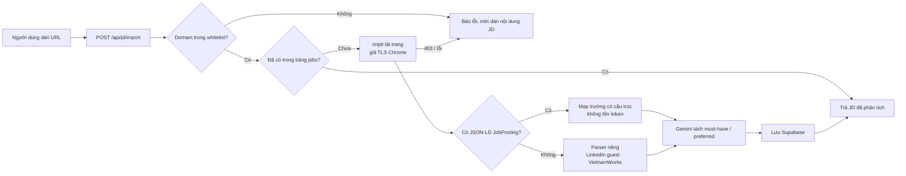
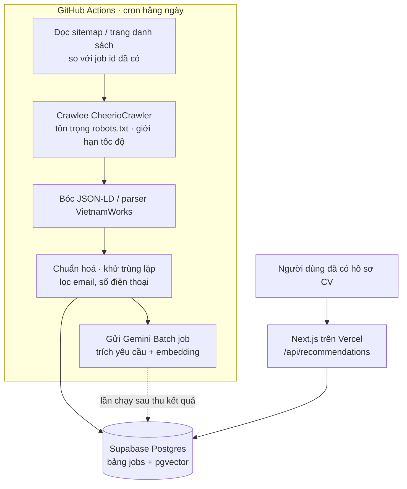

# JobAlign — Lựa chọn công nghệ: Lấy JD từ jobsite

> **Đầu việc:** `MASTERPLAN` — STT 8 "Lựa chọn công nghệ"
> **PIC:** Khánh Ngọc (theo `MASTERPLAN`) · **Thời hạn:** 11/09 → 13/09 · **Phiên bản:** v1.0 (13/09)
> **Nguồn:** [05-urd.md](05-urd.md), kiểm thử thực tế ngày 13/09/2026 ([mục 3](#3-kết-quả-kiểm-thử-thực-tế))

---

## 1. Tóm tắt quyết định

Tài liệu chọn công nghệ cho hai cách đưa JD từ các trang tuyển dụng vào JobAlign. Stack nền
(Next.js + TypeScript, Supabase, Vercel, Gemini) giữ như `MASTERPLAN`; các điểm cần kiểm lại
của stack nền nằm ở [mục 6](#6-ghi-chú-về-stack-nền).

| | Trường hợp 1 — Nhập JD từ URL | Trường hợp 2 — Kho JD tự động + gợi ý JD |
| --- | --- | --- |
| **Người dùng làm gì** | Dán link tin tuyển dụng, hệ thống tự lấy nội dung | Không làm gì; hệ thống tự quét định kỳ, gợi ý JD hợp với CV |
| **Chạy ở đâu** | API route Next.js trên Vercel, chỉ khi người dùng bấm | GitHub Actions chạy theo lịch hằng ngày, ghi vào Supabase |
| **Công nghệ chính** | `impit` (giả dấu vân tay TLS của Chrome) + JSON-LD `JobPosting` + Gemini | Crawlee + JSON-LD + Gemini Batch API + `gemini-embedding-2` + pgvector |
| **Nguồn** | Mọi trang trong whitelist, kể cả TopCV và LinkedIn | Chỉ trang có `robots.txt` cho phép **và** không chặn bot: ITviec, TopDev, VietnamWorks, CareerLink |
| **Đã kiểm chứng** | Lấy được JD từ 9 trang (từ IP cá nhân) | Robots, sitemap, JSON-LD của từng nguồn; chưa chạy thử từ IP của GitHub Actions |
| **Rủi ro lớn nhất** | IP datacenter của Vercel có thể bị chặn | Điều khoản sử dụng và bản quyền nội dung của các trang nguồn |

**Hệ quả với URD:** giả định G1 ("hệ thống **không** crawl jobsite") không còn đúng — đề xuất sửa ở
[mục 8](#8-đề-xuất-cập-nhật-urd).

## 2. Bối cảnh

URD (G1, ghi chú UR-3.2) đang giả định người dùng phải tự dán JD vì "TopCV và các trang tương tự
chặn bot". Việc copy JD từ jobsite rồi dán lại tốn thời gian của người dùng, nên nhóm xét hai
hướng tự động hoá:

1. **Nhập JD từ URL** — người dùng chỉ dán link, web tự lấy JD.
2. **Kho JD tự động** — web tự quét JD từ các jobsite để có sẵn một kho, rồi dùng kho đó gợi ý JD
   phù hợp với CV của người dùng.

Yêu cầu của nhóm: toàn bộ việc lấy JD chạy **phía server** — không dùng extension, bookmarklet
hay bất kỳ cơ chế nào chạy trên trình duyệt người dùng.

## 3. Kết quả kiểm thử thực tế

Thử ngày 13/09/2026 từ một IP cá nhân tại Việt Nam, trên trang chi tiết của tin đang tuyển.

| Trang | `robots.txt` với bot chung | HTTP thường | Bot khai tên thật¹ | Giả TLS Chrome (`impit`) | JSON-LD `JobPosting` | Sitemap tin |
| --- | --- | --- | --- | --- | --- | --- |
| ITviec | Cho phép | ✅ | ✅ | ✅ | ✅ | 735 tin |
| TopDev | Cho phép | ✅ (thỉnh thoảng lỗi kết nối) | ✅ | ✅ | ✅ | ~10.000 URL |
| CareerLink | Cho phép | ✅ | ✅ | ✅ | ✅ | Không có |
| VietnamWorks | Cho phép | ✅ | ✅ | ✅ | ❌ JD nằm trong dữ liệu Next.js | 10.251 URL |
| CareerViet | **Chặn** (`Disallow: /`, chỉ mở cho Googlebot, GPTBot…) | ✅ | ✅ | ✅ | ✅ | Không có |
| TopCV | Cho phép trang tin | ❌ 403 Cloudflare | ❌ 403 | ✅ | ✅ | ~43.000 URL (gồm tin cũ) |
| JobsGO | Cho phép | ❌ 403 Cloudflare | ❌ 403 | ✅ | ✅ | 29.103 URL |
| Glints | Cho phép trang tin | ❌ 403 | Chưa thử | ✅ | ✅ | Mẫu 600 URL không có tin VN |
| LinkedIn | **Chặn toàn bộ** (`Disallow: /`) | ✅ qua endpoint guest | Chưa thử | ✅ | ❌ | Không; tìm kiếm guest hết kết quả trước vị trí 990 |

¹ User-Agent dạng `JobAlignBot/0.1 (student project; +mailto:…)`.

**Rút ra từ bảng**

- Hầu hết jobsite Việt Nam nhúng sẵn `schema.org/JobPosting` (để lên Google for Jobs): tên vị trí,
  công ty, mô tả, lương, địa điểm, kỹ năng, hạn nộp. Đọc khối này là đủ, **không tốn token LLM**
  và không phải viết selector riêng cho từng trang.
- TopCV, JobsGO, Glints chặn theo **dấu vân tay kết nối (TLS/HTTP2)**, không chặn theo IP: cùng một
  máy, `curl`/`fetch` và Chromium headless bị 403, còn client giả TLS của Chrome nhận 200.
- Các phương án khác đã thử và không dùng được cho TopCV: Chromium headless (403), Jina Reader
  (403), Google for Jobs (không có tin TopCV trong 20 kết quả mẫu, không tìm thấy 2 tin cụ thể).
- Gemini URL context: thử trên AI Studio 2 lần đều báo "An internal error has occurred" (tài khoản
  chưa gắn API key) → **chưa xác minh**.

## 4. Trường hợp 1 — Nhập JD từ URL

### 4.1. Luồng xử lý



### 4.2. Công nghệ chọn

| Thành phần | Chọn | Lý do |
| --- | --- | --- |
| API | Next.js Route Handler, `runtime = 'nodejs'` | Cùng repo với web; `impit` là module native nên không chạy trên Edge runtime |
| Tải trang | [`impit`](https://www.npmjs.com/package/impit) (Apify), `browser: 'chrome'` | Qua được TopCV, JobsGO, Glints (~1 giây/trang); có bản dựng sẵn `linux-x64-gnu` cho môi trường Vercel; cần `serverExternalPackages: ['impit']` trong `next.config` |
| Đọc HTML | `cheerio` | Lấy `<script type="application/ld+json">` và viết parser riêng cho LinkedIn, VietnamWorks |
| Kiểm schema | `zod` | Trường không có trong JD → `Unknown` (NT-3), không tự điền |
| Trích yêu cầu | Gemini, structured output | Tách must-have / preferred như luồng dán tay ở UR-1.3 |
| Lưu | Bảng `jobs` trong Supabase (dùng chung với trường hợp 2) | Mỗi JD chỉ đọc một lần (NFR-2) |

**Chuẩn hoá URL theo nguồn**

- LinkedIn: lấy job id từ `/jobs/view/<id>` hoặc `?currentJobId=<id>`, gọi
  `https://www.linkedin.com/jobs-guest/jobs/api/jobPosting/<id>` rồi lấy text mô tả (~3.400 ký tự ở tin thử).
- VietnamWorks: đọc trường `jobDescription` / `jobRequirement` trong dữ liệu Next.js của trang.
- Còn lại: JSON-LD `JobPosting`.

```ts
// app/api/jd/import/route.ts
import { Impit } from 'impit';
export const runtime = 'nodejs';
const impit = new Impit({ browser: 'chrome', timeout: 15000 });

export async function POST(req: Request) {
  const { url } = await req.json();
  const target = normalizeUrl(url);          // whitelist domain + LinkedIn → jobs-guest URL
  const res = await impit.fetch(target);
  if (res.status !== 200) return Response.json({ error: 'blocked', status: res.status }, { status: 422 });
  const html = await res.text();
  const jobPosting = extractJobPosting(html); // đọc <script type="application/ld+json">
  return Response.json(jobPosting ? fromJsonLd(jobPosting) : { rawText: toText(html) });
}
```

### 4.3. Phương án đã cân nhắc và loại

| Phương án | Lý do loại |
| --- | --- |
| Puppeteer / `@sparticuz/chromium` trên Vercel | Nặng, chậm; Chromium headless vẫn bị TopCV chặn |
| Jina Reader, dịch vụ đọc URL công khai | Bị TopCV chặn |
| API tổng hợp Google for Jobs (SerpApi, JSearch) | Không có tin TopCV; tốn phí theo lượt |
| Gemini URL context | Chưa xác minh được; tốn token cả trang; LLM đọc trang khó bảo đảm "không suy đoán" |
| Proxy dân cư / dịch vụ vượt anti-bot | Tốn phí; không cần vì `impit` đã qua được từ IP cá nhân |
| Extension, bookmarklet, "dán thông minh" | Nhóm chọn chỉ xử lý phía server |

### 4.4. Rủi ro

| # | Rủi ro | Cách xử lý |
| --- | --- | --- |
| T1-1 | **Chưa thử từ IP của Vercel.** Cloudflare chấm điểm IP datacenter khắt khe hơn, có thể bắt giải thử thách JS mà `impit` không vượt được | Làm spike deploy route lên Vercel, gọi 10 link mỗi trang trước khi chốt. Nếu TopCV bị chặn: tạm bỏ TopCV khỏi whitelist, hoặc dùng dịch vụ scraping trả phí chỉ cho domain đó |
| T1-2 | Điều khoản: TopCV cấm sao chép, khai thác "Nội dung TopCV" khi chưa được phép; LinkedIn cấm truy cập tự động (LinkedIn đã thắng kiện hiQ, Proxycurl phải đóng cửa 07/2025). Giả TLS là lách cơ chế chặn bot | Chỉ lấy khi người dùng chủ động nhập một link; giới hạn số link mỗi người mỗi ngày; không đưa JD lấy theo cách này vào kho chung ([mục 5.1](#51-phạm-vi-nguồn)); ghi rõ giới hạn trong báo cáo môn học |
| T1-3 | Trang đổi cơ chế chặn hoặc LinkedIn đổi endpoint guest (không chính thức) | Ghi log tỷ lệ lỗi theo domain; luôn giữ ô dán nội dung JD làm đường lui |
| T1-4 | SSRF: server bị lợi dụng gọi vào địa chỉ nội bộ | Chỉ nhận `https` và domain trong whitelist; không theo redirect ra ngoài whitelist; timeout 15 giây |
| T1-5 | Tin hết hạn: VietnamWorks trả trang 410; TopCV vẫn hiện tin dù đã quá `validThrough` | Đọc `validThrough` và mã HTTP, cảnh báo người dùng |

## 5. Trường hợp 2 — Kho JD tự động và gợi ý JD theo CV

### 5.1. Phạm vi nguồn

Crawl hàng loạt khác hẳn việc lấy một link do người dùng nhập: hệ thống chủ động sao chép dữ liệu
của trang khác với khối lượng lớn. Vì vậy phạm vi nguồn được chia theo mức trang nguồn cho phép.

| Nhóm | Nguồn | Điều kiện | Đề xuất |
| --- | --- | --- | --- |
| **A** | ITviec, TopDev, VietnamWorks, CareerLink | `robots.txt` cho phép, nhận bot khai tên thật | **Đưa vào kho** |
| **B** | TopCV, JobsGO, Glints | `robots.txt` cho phép nhưng tường lửa chặn mọi client không phải trình duyệt | **Không đưa vào kho.** Muốn lấy phải giả TLS ở quy mô lớn, tức lách chặn có hệ thống. Chỉ xét lại nếu giảng viên đồng ý và nhóm chấp nhận rủi ro ở [mục 5.6](#56-nguyên-tắc-crawl-có-trách-nhiệm) |
| **C** | LinkedIn, CareerViet | `robots.txt` chặn bot chung | **Loại** |

Hệ quả: kho nghiêng về IT (ITviec, TopDev) và văn phòng (VietnamWorks, CareerLink). JD từ nguồn nhóm
B/C vẫn dùng được qua trường hợp 1 cho từng người dùng, nhưng không đưa vào kho chung.

### 5.2. Kiến trúc



**Chu kỳ hằng ngày**

1. **Tìm URL mới:** VietnamWorks, TopDev, ITviec đọc sitemap; CareerLink đi theo trang danh sách mới
   nhất, dừng khi gặp job id đã có. `lastmod` trong sitemap VietnamWorks đều mang ngày hôm nay nên
   không dùng được — so tập job id với database để biết tin mới.
2. **Tải và bóc tách:** chỉ tải URL mới và tin đang active cần kiểm lại.
3. **Khử trùng lặp:** khoá `(source, source_job_id)`; `content_hash` không đổi thì bỏ qua, không gọi
   LLM lại.
4. **Hết hạn:** quá `validThrough`, HTTP 404/410, hoặc biến mất khỏi sitemap → `status = expired`; xoá
   sau 30 ngày.
5. **Làm giàu dữ liệu:** gửi Gemini Batch API (giá bằng 50% gọi thường, trả kết quả trong vòng 24 giờ)
   để trích yêu cầu theo **cùng schema với UR-1.3** và tạo embedding.

### 5.3. Công nghệ chọn

| Thành phần | Chọn | Lý do | Đã cân nhắc và loại |
| --- | --- | --- | --- |
| Lập lịch, chạy crawler | GitHub Actions scheduled workflow | Không cần máy chủ; repo private có 2.000 phút/tháng miễn phí; một job chạy tối đa 6 giờ | **Vercel Cron:** gói Hobby chỉ chạy 1 lần/ngày, function tối đa 300 giây — không đủ cho hàng nghìn trang. **Apify:** chạy Crawlee trên cloud rất tiện nhưng tốn phí khi vượt gói miễn phí (proxy dân cư 8 USD/GB) |
| Framework crawl | [Crawlee](https://crawlee.dev) `CheerioCrawler` (TypeScript) | Có sẵn hàng đợi, retry, giới hạn tốc độ, `respectRobotsTxtFile`; cùng ngôn ngữ với web | Tự viết vòng lặp `fetch`: phải tự làm queue, retry, robots |
| HTTP client | Client mặc định của Crawlee, User-Agent `JobAlignBot` | Nguồn nhóm A nhận bot khai tên thật | `@crawlee/impit-client` (giả TLS): chỉ cần nếu đưa nhóm B vào |
| Bóc tách | JSON-LD `JobPosting` + parser VietnamWorks | Có sẵn ở 3/4 nguồn nhóm A; không tốn token | LLM đọc cả trang: tốn token, khó bảo đảm "không suy đoán" |
| Trích yêu cầu | Gemini Batch API, schema chung với UR-1.3 | Rẻ hơn 50%; kho không cần kết quả tức thì | Gọi API thường: giá gấp đôi |
| Embedding | `gemini-embedding-2`, 768 chiều | Hỗ trợ hơn 100 ngôn ngữ (CV tiếng Việt ↔ JD tiếng Anh); đầu vào tối đa 8.192 token; batch 0,10 USD/1M token; cùng nhà cung cấp LLM | 3.072 chiều (mặc định): vượt giới hạn 2.000 chiều của index HNSW kiểu `vector` |
| Lưu trữ, tìm vector | Supabase Postgres + `pgvector` (HNSW, cosine) | Đã có trong stack; lọc SQL và tìm vector trong cùng một truy vấn | Vector DB riêng (Pinecone…): thêm một dịch vụ, không cần ở quy mô vài chục nghìn JD |
| Tìm theo từ khoá | `pg_trgm` + `unaccent` | Postgres không có bộ tách từ tiếng Việt | Full-text search mặc định của Postgres |
| Xếp hạng cuối | Bộ chấm rule của UR-1.4 / UR-1.5 | Giải thích được, tái lập được (NFR-4, NFR-5) | LLM xếp hạng: tốn tiền, mỗi lần chạy một kết quả |

**Bảng `jobs` (tối thiểu, dùng chung cho cả hai trường hợp)**

| Cột | Kiểu | Ghi chú |
| --- | --- | --- |
| `source`, `source_job_id` | `text` | Khoá duy nhất; `source = 'user_import'` cho JD nhập từ URL |
| `url` | `text` | Link tin gốc, luôn hiển thị |
| `title`, `company` | `text` | |
| `city`, `work_mode` | `text` | `null` = `Unknown` |
| `salary_min`, `salary_max`, `currency` | `numeric`, `text` | `null` = `Unknown`, không coi là không đạt |
| `date_posted`, `valid_through` | `timestamptz` | |
| `description` | `text` | Đã lọc email, số điện thoại |
| `requirements` | `jsonb` | Must-have / preferred / seniority… theo schema UR-1.3 |
| `skills` | `text[]` | Id kỹ năng theo taxonomy (R2) |
| `embedding` | `vector(768)` | Index HNSW, `vector_cosine_ops` |
| `content_hash` | `text` | Phát hiện thay đổi |
| `status` | `text` | `active` / `expired` |
| `first_seen_at`, `last_seen_at`, `extracted_at` | `timestamptz` | |

Thêm bảng `crawl_runs` (nguồn, số trang, số lỗi, số lần bị chặn) để theo dõi sức khoẻ crawler.

### 5.4. Gợi ý JD theo CV

Ba tầng, tầng sau chỉ chạy trên kết quả của tầng trước:

1. **Lọc cứng (SQL):** tin `active`; khớp deal-breaker ở UR-1.2 (thành phố, work mode, lương tối
   thiểu). Trường `Unknown` **không** bị loại, chỉ gắn cờ (NT-3).
2. **Tìm ứng viên (top 100):** kết hợp độ gần ngữ nghĩa (embedding hồ sơ ↔ embedding JD) với tỷ lệ
   trùng kỹ năng theo taxonomy. Trọng số khởi điểm đề xuất 0,6 / 0,4, nhóm chốt sau khi thử.
3. **Xếp hạng cuối (top 20):** chạy bộ chấm Role Readiness + Work Fit đã có (UR-1.4, UR-1.5), phân
   loại vào ma trận hai chiều (UR-1.6). Mỗi gợi ý kèm giải thích và nút "Xem tin gốc".

```sql
select id, title, company, url
from jobs
where status = 'active'
  and (city is null or city = any(:cities) or work_mode = 'remote')
  and (salary_max is null or salary_max >= :salary_min)
order by embedding <=> :profile_embedding
limit 100;
```

- **Văn bản để tạo embedding:** hồ sơ = vị trí mục tiêu + kỹ năng + tóm tắt kinh nghiệm (lấy từ hồ sơ
  có cấu trúc ở UR-1.1); JD = tên vị trí + kỹ năng must-have + tóm tắt công việc. Thêm chỉ dẫn tác vụ
  vào đầu văn bản theo hướng dẫn của `gemini-embedding-2`.
- **Không dùng LLM để xếp hạng:** giữ đúng G4 ("chấm điểm do code thực hiện") và NFR-5.

### 5.5. Ước tính khối lượng và chi phí

Giả định kho ban đầu **~20.000 JD** từ nhóm A; mỗi JD ~2.000 token vào + 400 token ra khi trích yêu
cầu, ~1.500 token khi tạo embedding. Giá lấy từ bảng giá Gemini API ngày 13/09/2026.

| Hạng mục | Model (Batch) | Giá / 1M token (vào / ra) | Ước tính lần nạp đầu |
| --- | --- | --- | --- |
| Trích yêu cầu | `gemini-2.5-flash-lite` | 0,05 / 0,20 USD | ≈ 3,6 USD |
| Trích yêu cầu | `gemini-3.1-flash-lite` | 0,125 / 0,75 USD | ≈ 11 USD |
| Embedding | `gemini-embedding-2` | 0,10 USD | ≈ 3 USD |

- **Chạy hằng ngày:** chỉ xử lý tin mới → vài trăm JD → chi phí không đáng kể. Khi phát triển có thể
  dùng free tier của Gemini API (có giới hạn lượt gọi).
- **Dung lượng:** ~12 KB/JD (mô tả ~4 KB, JSON yêu cầu ~2 KB, vector 768 chiều ~3 KB, index) →
  20.000 JD ≈ 240 MB, vừa gói Supabase Free (500 MB). Thêm TopCV + JobsGO (~70.000 URL) sẽ vượt gói Free.
- **Thời gian crawl:** ở tốc độ 1 request / 2,5 giây mỗi nguồn, riêng VietnamWorks (10.251 URL) mất
  ~7 giờ → lần nạp đầu chia thành nhiều lần chạy ≤ 6 giờ. Chạy hằng ngày < 30 phút → ≤ 900 phút/tháng,
  trong hạn mức 2.000 phút.

### 5.6. Nguyên tắc crawl có trách nhiệm

1. Bật `respectRobotsTxtFile`; không crawl nhánh bị `Disallow`.
2. Không lách cơ chế chặn bot khi crawl hàng loạt (không giả TLS, không xoay proxy).
3. User-Agent khai tên JobAlign kèm email liên hệ; ≤ 1 request / 2–3 giây mỗi nguồn; chạy giờ thấp điểm.
4. Lưu tối thiểu: không lưu HTML gốc; lọc email, số điện thoại, tên người liên hệ trước khi lưu (Luật
   Bảo vệ dữ liệu cá nhân số 91/2025/QH15, hiệu lực 01/01/2026).
5. Hiển thị tóm tắt yêu cầu kèm link tin gốc, không đăng lại toàn văn JD công khai; ẩn tin hết hạn.
6. Không thương mại hoá kho; dừng crawl và xoá dữ liệu ngay khi chủ trang yêu cầu.

Điều khoản của các trang nguồn: TopCV cấm sao chép, khai thác nội dung khi chưa được phép; VietnamWorks
khẳng định quyền sở hữu nội dung và yêu cầu hợp tác chống sao chép tin đăng trái phép. Nhóm nên trình
bày phạm vi và các nguyên tắc trên với giảng viên trước khi bật crawler. *Mục này không phải tư vấn pháp lý.*

### 5.7. Phương án thay thế hoặc bổ sung

| Phương án | Ưu | Nhược |
| --- | --- | --- |
| **Kho JD từ chính JD người dùng nhập** (trường hợp 1, chỉ nguồn nhóm A) | Hợp lệ nhất, không crawl; kho lớn dần theo nhu cầu thật | Lúc đầu rất ít JD |
| **SerpApi Google Jobs API** | Có trường `description`, phân trang `next_page_token`; Google Jobs VN tổng hợp CareerViet, CareerLink, JobsGO, VietnamWorks, Glints, Joboko… | Trả phí theo lượt tìm (~10 tin/lượt); không có TopCV; **chưa thử API** |
| **Xin feed / hợp tác với jobsite** | Chính thống, dữ liệu sạch | Không kịp tiến độ môn học |

### 5.8. Rủi ro

| # | Rủi ro | Cách xử lý |
| --- | --- | --- |
| T2-1 | **Chưa thử từ IP của GitHub Actions** (datacenter Azure): nguồn nhóm A có thể chặn hoặc giới hạn | Chạy thử workflow với 100 URL mỗi nguồn trước khi nạp toàn bộ |
| T2-2 | Điều khoản và bản quyền nội dung của trang nguồn | Nguyên tắc ở [mục 5.6](#56-nguyên-tắc-crawl-có-trách-nhiệm); xin ý kiến giảng viên |
| T2-3 | Kho lệch ngành (nhiều IT) → gợi ý kém cho ngành khác | Nói rõ phạm vi ngành trên giao diện; bổ sung bằng JD người dùng nhập |
| T2-4 | Scheduled workflow có thể bị GitHub tự tắt khi repo không có hoạt động 60 ngày; chạy trễ giờ | Theo dõi bảng `crawl_runs`; cảnh báo khi quá 2 ngày không có lần chạy thành công |
| T2-5 | Vượt 500 MB của Supabase Free | Không lưu HTML; xoá tin hết hạn sau 30 ngày; giới hạn nguồn |
| T2-6 | Chất lượng gợi ý phụ thuộc taxonomy kỹ năng (R2 trong URD) | Làm taxonomy trước khi làm gợi ý |

## 6. Ghi chú về stack nền

| Hạng mục | Hiện trạng (13/09/2026) | Đề xuất |
| --- | --- | --- |
| **LLM** `gemini-2.5-flash-lite` | Còn trong bảng giá Gemini API; trang deprecations ghi "chưa công bố ngày ngừng". Nhưng trang vòng đời model của Google Cloud ghi ngày ngừng 20/10/2026, diễn đàn có báo lỗi 404 "no longer available" từ 07/2026, và AI Studio không còn liệt kê model này | Đặt tên model trong biến môi trường `GEMINI_MODEL`; thử ngay bằng API key của nhóm. Phương án thay: `gemini-3.1-flash-lite` (ngừng sớm nhất 07/05/2027) hoặc `gemini-3.5-flash-lite` |
| **Vercel Hobby** | Function tối đa 300 giây, 2 GB RAM; cron 1 lần/ngày; IP datacenter | Chỉ dùng cho web và API tức thời, không chạy crawler |
| **Supabase Free** | Database 500 MB; project tạm dừng nếu ~1 tuần không có hoạt động | Crawler chạy hằng ngày giúp giữ project hoạt động; theo dõi dung lượng |
| **GitHub Actions** | Repo private: 2.000 phút/tháng; job tối đa 6 giờ. Repo `kng1226/JobAlign` không truy cập công khai được (có thể là private) | Đặt crawler trong repo chung, secret Supabase lưu ở GitHub Secrets |

## 7. Việc cần làm tiếp

| # | Việc | Người làm / quyết | Chặn |
| --- | --- | --- | --- |
| 1 | Spike: deploy `/api/jd/import` lên Vercel, gọi 10 link mỗi trang, ghi tỷ lệ thành công | Dev | Chốt trường hợp 1 |
| 2 | Spike: workflow GitHub Actions crawl 100 URL mỗi nguồn nhóm A | Dev | Chốt trường hợp 2 |
| 3 | Thử API key Gemini: `gemini-2.5-flash-lite` còn gọi được không; thử URL context | Dev | Chốt model LLM |
| 4 | Quyết định phạm vi nguồn của kho (có xét nhóm B không) | Cả nhóm + giảng viên | [mục 5.1](#51-phạm-vi-nguồn) |
| 5 | Chốt taxonomy kỹ năng và trọng số gợi ý | Cả nhóm | R1, R2 trong URD |
| 6 | Cập nhật URD theo [mục 8](#8-đề-xuất-cập-nhật-urd) | PIC URD | — |

## 8. Đề xuất cập nhật URD

| Vị trí trong [05-urd.md](05-urd.md) | Hiện tại | Đề xuất |
| --- | --- | --- |
| Mục 10, giả định G1 | Người dùng tự dán / upload JD; hệ thống **không** crawl jobsite | Người dùng dán URL hoặc nội dung JD; hệ thống tự lấy JD từ URL. Kho JD tự động chỉ lấy từ nguồn có `robots.txt` cho phép và không chặn bot |
| UR-3.2, ghi chú từ sheet | Không crawl được jobsite → JD do người dùng tự dán | Bỏ ghi chú; Multi-JD Intelligence dùng được cả JD trong kho |
| UR-1.3 | — | Thêm yêu cầu **JD Import from URL** (S) |
| Nhóm 3 | — | Thêm module **Job Recommendation**: lọc theo kỳ vọng, gợi ý theo hồ sơ, giải thích, link tin gốc (C). Cần thêm vào sheet `DESCRIPTION` để giữ đánh số `UR-x.y.z` |
| Mục 9, NFR | — | **NFR-9** Crawl có trách nhiệm ([mục 5.6](#56-nguyên-tắc-crawl-có-trách-nhiệm)); **NFR-10** Import URL chống SSRF; **NFR-11** Không lưu dữ liệu cá nhân có trong JD |
| Mục 10, ràng buộc kỹ thuật | LLM `gemini-2.5-flash-lite` | Ghi thêm phương án thay thế model ([mục 6](#6-ghi-chú-về-stack-nền)) |
| Mục 11, rủi ro | — | Thêm T1-1, T2-1 (IP datacenter bị chặn) và T1-2, T2-2 (điều khoản nguồn) |

---

## Nguồn tham khảo

- Kiểm thử thực tế 13/09/2026: `robots.txt`, sitemap và trang chi tiết tin của từng jobsite ở [mục 3](#3-kết-quả-kiểm-thử-thực-tế)
- [Crawlee — Impit HTTP Client](https://crawlee.dev/js/docs/guides/impit-http-client) · [BasicCrawlerOptions (`respectRobotsTxtFile`)](https://crawlee.dev/js/api/next/basic-crawler/interface/BasicCrawlerOptions)
- [Gemini API — Pricing](https://ai.google.dev/gemini-api/docs/pricing) · [Embeddings](https://ai.google.dev/gemini-api/docs/embeddings) · [Batch API](https://ai.google.dev/gemini-api/docs/batch-api) · [URL context](https://ai.google.dev/gemini-api/docs/url-context) · [Deprecations](https://ai.google.dev/gemini-api/docs/deprecations)
- [Google Cloud — Model versions and lifecycle](https://docs.cloud.google.com/gemini-enterprise-agent-platform/models/model-versions) · [Diễn đàn: gemini-2.5-flash-lite trả 404](https://discuss.ai.google.dev/t/gemini-2-5-flash-and-gemini-2-5-flash-lite-returning-404-no-longer-available-today-july-9-contradicts-oct-16-2026-shutdown-date/174267)
- [Vercel — Functions limits](https://vercel.com/docs/functions/limitations) · [Cron Jobs usage & pricing](https://vercel.com/docs/cron-jobs/usage-and-pricing)
- [Supabase — Free project pausing](https://supabase.com/docs/guides/platform/free-project-pausing) · [Database size](https://supabase.com/docs/guides/platform/database-size) · [HNSW indexes](https://supabase.com/docs/guides/ai/vector-indexes/hnsw-indexes)
- [pgvector — giới hạn số chiều khi đánh index](https://github.com/pgvector/pgvector)
- [GitHub Actions — Billing and usage](https://docs.github.com/en/actions/concepts/billing-and-usage) · [Actions limits](https://docs.github.com/en/actions/reference/limits)
- [SerpApi — Google Jobs API](https://serpapi.com/google-jobs-api) · [Apify pricing](https://apify.com/pricing)
- [TopCV — Điều khoản dịch vụ](https://www.topcv.vn/terms-of-service) · [VietnamWorks — Thoả thuận sử dụng](https://www.vietnamworks.com/thoa-thuan-su-dung)
- [LinkedIn thắng kiện Proxycurl](https://www.socialmediatoday.com/news/linkedin-wins-legal-case-data-scrapers-proxycurl/756101/)
- [Luật Bảo vệ dữ liệu cá nhân số 91/2025/QH15](https://thuvienphapluat.vn/van-ban/Bo-may-hanh-chinh/Luat-Bao-ve-du-lieu-ca-nhan-2025-so-91-2025-QH15-625628.aspx)
